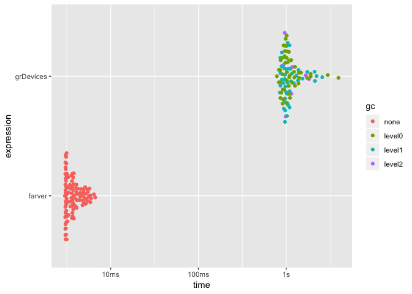

<!-- README.md is generated from README.Rmd. Please edit that file -->
farver
======

[](https://travis-ci.org/thomasp85/farver) [](https://ci.appveyor.com/project/thomasp85/farver) [](http://cran.r-project.org/package=farver) [](http://cran.r-project.org/package=farver) [](https://codecov.io/github/thomasp85/farver?branch=master)

The goal of `farver` is to provide very fast, vectorised conversion of colours between different colour spaces, as well as provide fast colour comparisons (distance between colours). To this end it provides an interface to a modified version of the [ColorSpace](https://github.com/berendeanicolae/ColorSpace) C++ library developed by Berendea Nicolae.

Installation
------------

`farver` can be installed from CRAN using `install.packages('farver')`. The development version can be installed from Github using `devtools`:

``` r
# install.packages('devtools')
devtools::install_github('thomasp85/farver')
```

Use
---

The main functions of the package are`convert_colour()` with an interface very much alike `grDevices::convertColor()`, and `compare_colour()` which allows you to calculate the distance between colours using different metrics

### Conversion

``` r
library(farver)

spectrum <- t(col2rgb(rainbow(10)))
spectrum
#>       red green blue
#>  [1,] 255     0    0
#>  [2,] 255   153    0
#>  [3,] 204   255    0
#>  [4,]  51   255    0
#>  [5,]   0   255  102
#>  [6,]   0   255  255
#>  [7,]   0   102  255
#>  [8,]  51     0  255
#>  [9,] 204     0  255
#> [10,] 255     0  153

convert_colour(spectrum, 'rgb', 'lab')
#>              l         a           b
#>  [1,] 53.24079  80.09246   67.203197
#>  [2,] 72.26072  30.16539   77.224482
#>  [3,] 93.60533 -41.94504   90.274226
#>  [4,] 88.07403 -83.10813   83.593379
#>  [5,] 88.19634 -80.27943   57.926987
#>  [6,] 91.11322 -48.08753  -14.131186
#>  [7,] 47.90478  35.19678  -82.006104
#>  [8,] 33.81896  79.70044 -105.279006
#>  [9,] 51.90416  90.99470  -74.834222
#> [10,] 55.65103  86.52861   -9.719051
```

### Comparison

``` r
spectrum2 <- t(col2rgb(heat.colors(10)))

compare_colour(spectrum, spectrum2, 'rgb', method = 'cie2000')[1:6, 1:6]
#>          [,1]      [,2]      [,3]     [,4]      [,5]     [,6]
#> [1,]  0.00000  1.950705  7.131114 15.53888 27.083292 39.89086
#> [2,] 29.50183 27.566791 22.403383 13.98164  2.416093 10.31364
#> [3,] 72.33700 70.330572 64.926952 55.98589 43.599157 30.24633
#> [4,] 85.84641 83.687702 77.853543 68.19825 55.060776 41.58806
#> [5,] 85.92047 83.796852 78.072403 68.67013 56.074572 43.42730
#> [6,] 70.95912 69.553268 65.907408 60.35762 53.722352 47.94419
```

Supported colour spaces
-----------------------

`farver` currently supports the following colour spaces:

-   CMY
-   CMYK
-   HSL
-   HSB
-   HSV
-   CIE L\*AB
-   Hunter LAB
-   LCH
-   LUV
-   RGB
-   XYZ
-   YXY

Supported distance measures
---------------------------

`farver` supports the following colour distance metrics

-   Euclidean
-   CIE1976
-   CIE94
-   CIE2000
-   CMC

Benchmark
---------

`farver` is substantially faster than its `grDevices` counterpart as all operation happens in compiled code:

``` r
library(ggplot2)
test <- matrix(runif(30000, min = 0, max = 255), ncol = 3)
timing <- bench::mark(
  farver = convert_colour(test, 'rgb', 'lab'),
  grDevices = convertColor(test, 'sRGB', 'Lab', scale.in = 255), 
  check = FALSE,
  iterations = 100,
  filter_gc = FALSE
)
autoplot(timing)
```



Limitations
-----------

Currently `farver` does not allow setting custom white points for the input and output colour spaces. Hopefully this will be added at a later stage.
